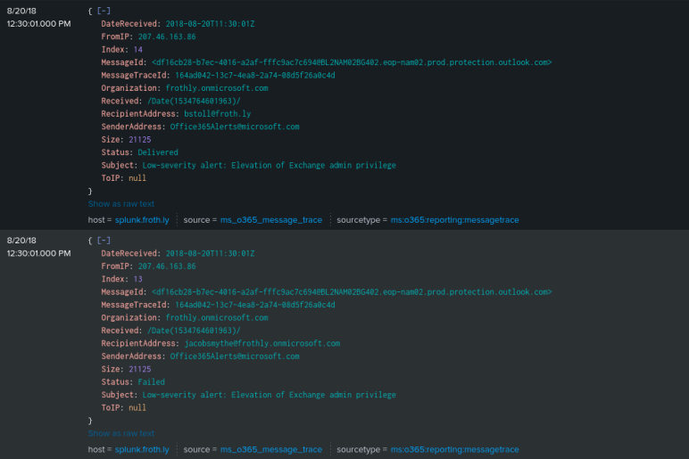

# APT Persistence via Cloud-Based Exfiltration (BOTSv3)


## Executive Summary

The attacker modified legitimate Microsoft Exchange transport rules to auto-forward security alerts to an external AWS infrastructure, effectively blinding the SOC to their activities.

**Incident Scope:** Full Kill-Chain Investigation (Delivery → Exploitation → Persistence)

**Severity:** Critical (Domain Compromise)

In this lab, I investigated a spearphishing attack targeting the "Frothly" organization. The investigation revealed a sophisticated kill chain where the attacker not only compromised an endpoint via macro malware but also established **cloud persistence** by modifying Microsoft Exchange transport rules.

**Objective:** The primary objective of this project was to simulate a real-world **Threat Hunting** engagement using the BOTSv3 dataset. The goal was to detect, analyze, and reconstruct a sophisticated kill chain—starting from a deceptive spearphishing email, tracking the endpoint execution of macro malware, and identifying a "Living off the Land" persistence mechanism within the cloud environment.

**Key Finding:** The attacker configured the environment to auto-forward critical security alerts to an external AWS infrastructure (`ubuntu@ec2...`), effectively blinding the SOC to their post-exploitation activities.

---

### 🛠️ Tools & Frameworks Used
---
* **SIEM:** Splunk Enterprise
* **Endpoint Telemetry:** Sysmon, PowerShell Script Block Logging
* **Forensics:** CyberChef (for Base64 decoding)
* **Framework:** MITRE ATT&CK (T1566.001, T1059.001, T1098)

---
## 🛠️ Skills Demonstrated
* **SIEM Querying (SPL):** Advanced filtering of SMTP streams to identify anomalous message flows.
* **Forensic Artifact Analysis:** Decoding Base64-encoded gateway replacements to recover original malware indicators.
* **Cloud Security Monitoring:** Correlating internal O365 administrative alerts with external threat infrastructure (AWS EC2).
* **Threat Intelligence:** Mapping observed behaviors to MITRE ATT&CK sub-techniques.

---

## Investigation Walkthrough

### 1. Initial Access: The Phish
I began by hunting for anomalies in the SMTP (email) stream. Searching for the keyword `*alert*` revealed that the email gateway had intercepted a suspicious attachment but may not have stopped the attack entirely.

**Splunk Query:**
```splunk
index=botsv3 sourcetype=stream:smtp *alert*
```

*Fig 1: Identifying the initial "Malware Alert" artifact.*

**Findings**: This query returned 3 critical events that formed the basis of the investigation:

1. "Low-severity alert: Elevation of Exchange admin privilege".

2. "Malware Alert Text.txt".

3. "AWS API Key exposed on Github".

#### Analyzing the Phishing Attack
I investigated the event containing the "Malware Alert Text" to understand the initial attack vector.

Details Recovered: 
* **Time**: 2018-08-20 T01:21:12 +01:00 GMT 
* **Sender**: bgist@froth.ly (Bruce Gist)
* **Recipients**:     bstoll@froth.ly (Bud Stoll) |    fyodor@froth.ly  (Fyodor Malteskesko)   |   ghoppy@froth.ly (Grace Hoppy) |     abungstein@froth.ly (AI Bungstein)
* **Subject**: "Here is a financial model we can use for FY2019 planning"
* **Original Attachment**: Frothly-Brewery-Financial-Planning-FY2019-Draft.xlsm (decoded) 
* **Malware Signature**: W97M.Empstage (Macro Virus)
* **MITRE Technique**: T1566.001 - Phishing: Spearphishing Attachment.


*Fig 2: Email headers showing the target recipients and the replaced attachment.*

### 2. Payload Analysis
Using **CyberChef**, I decoded the Base64 content of the gateway's replacement file. This confirmed the original attachment was `Frothly-Brewery-Financial-Planning-FY2019-Draft.xlsm`, which contained the **W97M.Empstage** macro virus.


*Fig 3: Recovering the original filename and malware signature.*

### 3. Endpoint Execution
To determine if the user bypassed the warning or if the file executed, I pivoted to the endpoint (`BGIST-L`) and queried **Sysmon Event ID 11 (File Create)**.

**Query:** 
```
index=botsv3 sourcetype="xmlwineventlog:microsoft-windows-sysmon/operational" *Frothly-Brewery-Financial-Planning*
```


*Fig 4: Confirmation that the malicious Excel file was written to disk.* 

Further analysis of **PowerShell Event Code 4104 (Script Block Logging)** revealed the macro spawning a script to execute remote commands, confirming a successful compromise.

**Analysis of Findings:**

**Time**: 2018-08-20 09:55:52.449

**Parent Image**: ...EXCEL.EXE (The malicious spreadsheet)

**Target Image**: ...HxTsr.exe (The payload, masquerading as a Windows system component)

**File Path**: C:\Users\BruceGist\...\Frothly-Brewery-Finance-Planning-FY2019-Draft.xlsm


*Fig 5: Malicious PowerShell script block execution.*

### 4. The Persistence Mechanism (Critical Finding)
The most dangerous part of this attack was the persistence. I investigated an "Elevation of Exchange Admin Privilege" alert that triggered shortly after the compromise. Remember, it was already alerted in the "Initial Access" search which then connected the dots.

**Query:** 
```
index=botsv3 *Elevation of Exchange admin privilege*
```


Analyzing the SMTP logs for this alert revealed that the attacker had created a **hidden forwarding rule**. The alert was sent to legitimate admins but was *also* BCC'd to an external attacker-controlled address.

| Recipient Address | Status | Role / Assessment |
| :--- | :--- | :--- |
| **bstoll@froth.ly** | Delivered | Legitimate Admin  |
| **fyodor@froth.ly** | Delivered | Legitimate Admin  |
| **klagerfield@froth.ly** | **Failed** | Anomaly  |
| **jacobsmythe@frothly.onmicrosoft.com** | **Failed** | Anomaly  |
| **postmaster@froth.ly** | **Failed** |  Anomaly  |
| **ubuntu@ec2-52...** | **Delivered** |  **MALICIOUS (Exfiltration to AWS)** |



              
*Fig 6: SMTP logs showing the alert being routed to `ubuntu@ec2-52-38-112-145...` (AWS).*


**Technical Insight:** By allowing the alert to reach legitimate admins (`bstoll` and `fyodor`), the attacker "blended in" with normal noise. If `bstoll` saw the alert, they might assume `fyodor` was working on the server. Meanwhile, the attacker received a copy of the alert on their external AWS instance, giving them real-time visibility into the SOC's awareness.

---

## Conclusion & Remediation

The investigation successfully mapped the full attack lifecycle.

1.  **Detection:** Identified the initial phish via SMTP log anomalies.
2.  **Confirmation:** Verified endpoint execution via Sysmon and PowerShell logs.
3.  **Discovery:** Uncovered a stealthy data exfiltration rule in the Exchange environment.

**Remediation Steps:**
* Isolate the compromised host (`BGIST-L`).
* Remove the malicious Exchange forwarding rule targeting the AWS EC2 instance.
* Reset credentials for the compromised user and administrators (`bstoll` and `fyodor`).